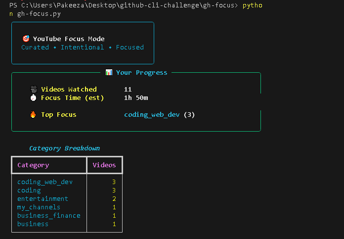

# 🎯 gh-focus

> **The Intentional Developer Feed. Stop Doomscrolling. Start Shipping.**

`gh-focus` is a GitHub CLI extension that transforms YouTube into a productivity tool. Browse only the channels you trust, watch ad-free, and automatically sync your learning log to a GitHub Gist—all from your terminal.




---

## 🚀 Quick Start (30 Seconds)

**1. Install the extension:**
```bash
gh extension install Pakeeza1508/gh-focus
```

**2. Launch:**
```bash
gh focus
```

**3. (Highly Recommended) Install MPV for Ad-Free viewing:**
- **Windows:** `winget install io.mpv.mpv`
- **macOS:** `brew install mpv`  
- **Linux:** `sudo apt-get install mpv`

That's it! 🎉

---

## ✨ Key Features

- **🧠 Curated Categories** — Organize learning into Coding, DevOps, Business, or AI/Data Science
- **⚡ Zero-Distraction Player** — Launches in MPV (ad-free, no comments, no sidebar)
- **🔄 GitHub Gist Sync** — Automatically build a "Learning Log" on your GitHub profile
- **🛠️ Hacker Engine** — Uses RSS feeds + parallel fetching. No YouTube API keys required
- **📊 Watch History** — Track what you learned and when, right in your terminal

---

## 🏆 Why This Matters (GitHub CLI Challenge 2026)

**The Problem:**  
You open YouTube to watch a Docker tutorial → algorithm recommends a 2-hour conference talk → 3 hours later you're watching "Top 10 Programming Fails" → your focus is destroyed.

**The Solution:**  
`gh-focus` is a **developer wellness extension** that:
- ✅ Keeps you focused on intentional learning (not doom-scrolling)
- ✅ Works offline after initial setup (no API dependencies)
- ✅ Integrates seamlessly with developer workflow (`gh focus` = instant context switch)
- ✅ Demonstrates creative use of GitHub CLI beyond traditional GitHub operations

---

## 🤖 Built with GitHub Copilot

This project was built for the **GitHub Copilot CLI Challenge 2026**. Copilot acted as a senior architect throughout development:

| Challenge | How Copilot Helped |
|-----------|-------------------|
| **URL Resolution** | Generated complex regex to resolve YouTube handles, channel IDs, and custom URLs |
| **Parallel Fetching** | Architected threading logic to fetch 50+ RSS feeds simultaneously in <1 second |
| **Cross-Platform** | Wrote `.cmd` (Windows) and bash wrappers to manage Python environments seamlessly |
| **Error Handling** | Suggested edge cases I hadn't considered (missing MPV, network failures, malformed feeds) |

**Time Saved:** ~15-20 hours of boilerplate and debugging work  
**Key Takeaway:** Copilot isn't just a code generator—it's a **thought partner** that suggests architectural patterns and optimizations.

---

## 🛠️ Usage & Configuration

Once inside `gh focus`, use arrow keys to navigate:

### Add a Channel
1. Select **+ Add New Channel**
2. Choose category (coding/business/etc.)
3. Enter channel name and ID (or paste a YouTube URL)

**Finding Channel IDs:**
- Visit the YouTube channel
- Right-click → View Page Source
- Search for `"channelId":"UC..."`

### Sync to Gist
After watching, choose **💾 Save to Learning Log**. The app creates/updates a file named `focus_learning_log.md` in your GitHub Gists.

### View Stats
```bash
gh focus --stats
```
See your watch history and total learning time.

---

## 📦 Tech Stack

- **Python 3.7+** — Core language
- **feedparser** — YouTube RSS feeds (no API key required!)
- **questionary** — Beautiful interactive CLI menus
- **rich** — Modern terminal formatting
- **GitHub CLI** — Gist sync integration

### Why This Stack?

✅ **No API Key** — YouTube RSS feeds work forever, no quota limits  
✅ **Lightweight** — Minimal dependencies, single Python entry point  
✅ **Extensible** — Easy to add new features (Pomodoro timer, channel auto-discovery, etc.)

---

## 🎬 Why `gh-focus` Belongs in the GitHub CLI Ecosystem

Most GitHub CLI extensions are **workflow automation** tools (create issues, manage PRs, deploy code).

`gh-focus` is different—it's a **developer wellness** tool that:

1. **Solves a Real Problem** — Prevents the #1 productivity killer: algorithmic distraction
2. **Extends GitHub's Purpose** — Uses GitHub Gists as a learning journal (not just code storage)
3. **Demonstrates CLI Creativity** — Shows that `gh` can enhance **cognitive efficiency**, not just operational efficiency

**YouTube's algorithm is designed to maximize watch time. `gh-focus` is designed to maximize learning outcomes.**

---

## 🔗 Links

- **Dev.to Submission:** https://dev.to/pz_khalid/focus-feed-a-github-cli-extension-for-intentional-learning-3852
- **GitHub Repository:** https://github.com/Pakeeza1508/gh-focus
- **Install Command:** `gh extension install Pakeeza1508/gh-focus`
- **Technical Deep Dive:** [CHALLENGES.md](CHALLENGES.md)

---

## 📄 License

MIT — Feel free to fork and build on this!

---

**🚀 GitHub CLI Challenge 2026 Submission**

*Built for developers who value their focus.*

---

## 🔗 Links

- **Dev.to Submission:** https://dev.to/pz_khalid/focus-feed-a-github-cli-extension-for-intentional-learning-3852
- **GitHub Repository:** https://github.com/Pakeeza1508/gh-focus
- **Extension Install:** `gh extension install Pakeeza1508/gh-focus`
- **Technical Challenges Documentation:** [CHALLENGES.md](CHALLENGES.md)

---

## License

MIT - Feel free to fork and build on this!

---

**🚀 GitHub CLI Challenge 2026 Submission**

*Built for developers who value their focus.*
